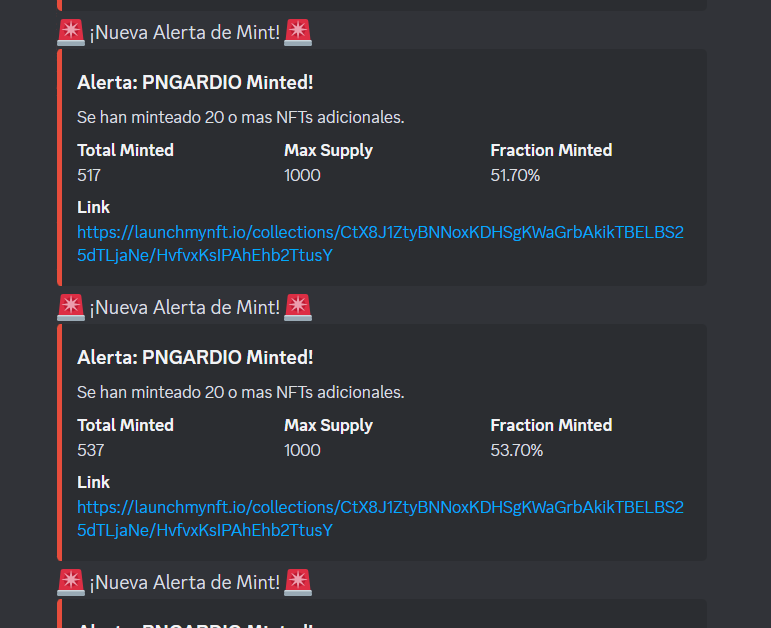
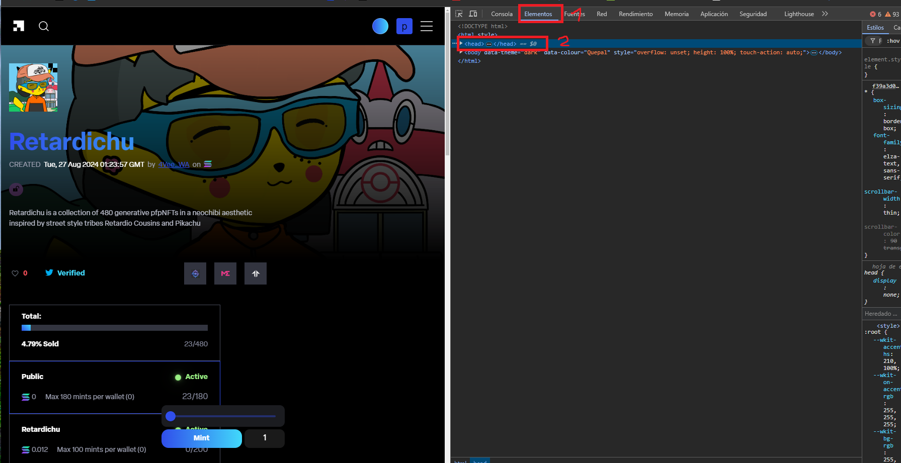
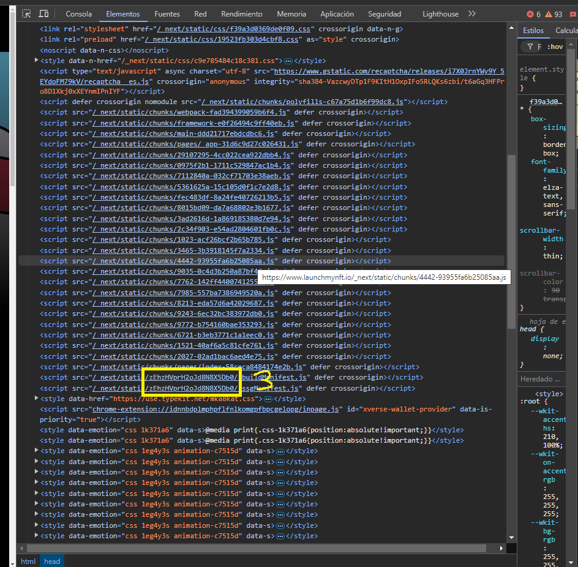

# Launch-my-nft-monitor

Launch-my-nft-monitor is a Discord bot designed to monitor NFT collections on the LaunchMyNFT platform. It sends alerts to a Discord channel when a specified number of NFTs have been minted.

## Features

- Monitors NFT collections for minting activity.
- Sends alerts to a Discord channel when a threshold is reached.
- Provides commands to start, stop, and list monitored collections.
- Allows updating the base URL for collection data.



## Installation

1. **Clone the repository:**
   ```bash
   git clone https://github.com/yourusername/Launch-my-nft-monitor.git
   cd Launch-my-nft-monitor
   ```

2. **Install dependencies:**
   Make sure you have Python and pip installed, then run:
   ```bash
   pip install requests discord
   ```

3. **Configure the bot:**
   - Update the `TOKEN`, `CHANNEL_ID`, and `webhook_url` with your Discord bot token, channel ID, and webhook URL. Also configure limit and wait time in the code if you want to change it.

## Usage

1. **Run the bot:**
   ```bash
   python Launchmynft.py
   ```

2. **Discord Commands:**
   - `!monitor <url>`: Start monitoring a specific NFT collection. There are two types of links:
     - Short link: `https://launchmynft.io/sol/7579`
     - Long link: `https://launchmynft.io/collections/J9GD7rWFmpfqwfp8yBXBdEjmt47bgGmEihRbXXuijksU/i5K5g9OahcbcwDUOIVvX`
     - **Always use the long link when adding a new collection.**
   - `!list`: List all currently monitored collections.
   - `!change <new_code>`: Update the base URL for collection data.
   - `!remove <url>`: Stop monitoring a specific collection.
   - `!stop`: Stop the bot.

3. **Handling Errors:**
   - If an error message appears, it may be due to a change in the code value.
   - Inspect the page source to find the new code (step 3 of photo).
   - Use the command `!change <new_code>` to update the base URL with the new code.
   
   

## Contributing

Contributions are welcome! Please fork the repository and submit a pull request for any improvements or bug fixes.

## License

This project is licensed under the MIT License. See the [LICENSE](LICENSE) file for details.

